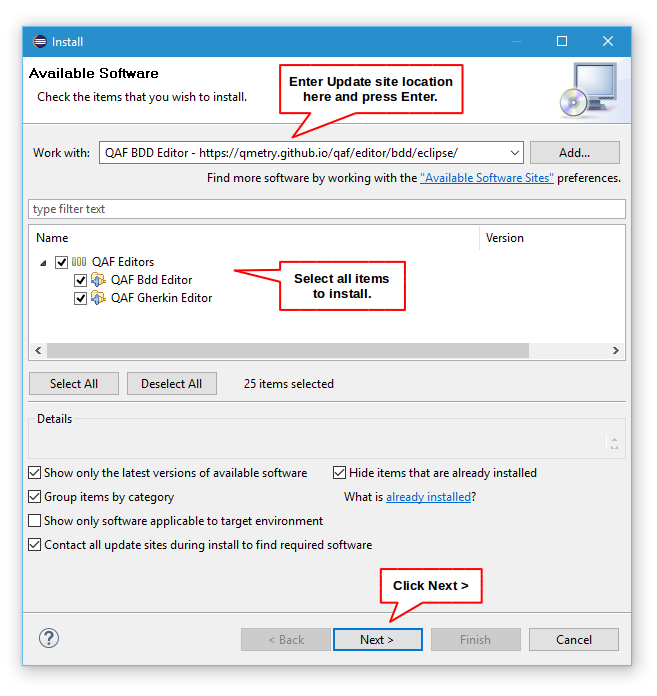

<h1>You're close!</h1>

This URL is an Eclipse <b>software repository</b>; you must use it in Eclipse (<a href="http://help.eclipse.org/topic/org.eclipse.platform.doc.user/tasks/tasks-127.htm">see how</a>).   

